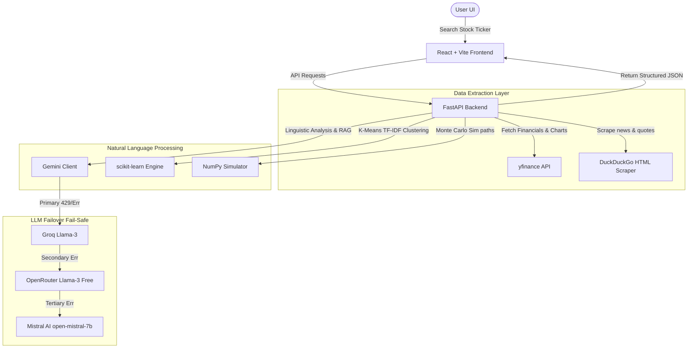

# AI Earnings Call Analyst - System Documentation

The **AI Earnings Call Analyst** is a premium, high-fidelity corporate intelligence dashboard designed to parse, analyze, and audit quarterly earnings call communications, financial statements, and investor presentations.

The system is designed on a hybrid stack combining traditional Data Science / NLP algorithms with Generative AI (using Google Gemini with automated failovers to Groq, OpenRouter, and Mistral AI).

---

## 1. System Architecture & Data Flow

Below is a conceptual architecture showing how the React frontend, the FastAPI backend, the external crawlers, and the multi-LLM client coordinate:

---

## 2. Core Modules (The 8 Modules)

The application implements 8 modules that translate complex financial disclosures into visual, interactive summaries:

### Module 1: Management Confidence Analysis
Tracks shifts in management confidence quarter-over-quarter by analyzing the language of the CEO and CFO.
* **Confidence Score Meter**: A circular gauge showing the latest confidence rating (0-100) compared to previous periods.
* **Linguistic Comparison Board**: Side-by-side cards highlighting exact remarks from the current vs. previous quarter, highlighting optimistic statements in green and defensive/cautious statements in red.
* **AI Confidence Narrative**: Auto-generates an explanation of *why* management's tone shifted, citing specific challenges or drivers.

### Module 2: Trend Tracking Across Quarters
Transforms historical financial columns into interactive charts to detect performance trends.
* **Revenue & Profitability Chart**: Dual-axis bar charts comparing total revenue and net income across 4 quarters.
* **Growth & Margin Trajectory**: Line charts tracing quarterly revenue growth (%) alongside operating margin (%).
* **AI Trend Detector**: An automated notification bar indicating whether a growth slowdown or margin recovery trend has been detected (e.g. sequentially decreasing growth rates).
* **1-Year Stock Price History**: Interactive area charts displaying monthly average close prices and volume details.

### Module 3: Bull vs Bear Arguments
Constructs a balanced view of the selected company by displaying competing investment theses.
* **The Bull Case**: Green-themed checklist outlining core strengths (market expansion, cloud adoption, product pipelines, easing bottlenecks).
* **The Bear Case**: Red-themed checklist outlining major headwinds (high valuations, margin pressures, geopolitical export restrictions, dependencies).
* **Investment Score**: Computes a ratio-based recommendation score (0 to 10) representing the balance of positive indicators to caution flags.

### Module 4: Hidden Risks Detector
Crawl transcripts and reports to classify hidden risks mentioned in the call.
* **Risk Assessment Profile**: A color-coded density meter showing the overall threat exposure (High, Medium, Low Risk) based on risk frequency.
* **Risk Categorization Cards**: Analyzes and segments risks into five categories: *Supply Chain, Regulatory, Legal, Debt, and Customer Concentration*.
* **Discussion Frequency Chart**: Horizontal bar charts comparing how many times each risk was mentioned.
* **Direct Transcript Citations**: Pulls the exact quote from the CEO/CFO discussing each specific risk, ensuring auditability.

### Module 5: Competitor Comparison
Provides a comparative intelligence matrix of the selected company against its sector peers.
* **Comparative Matrix Table**: Compares current Revenue Growth (%), Operating Margins (%), and Confidence Scores side-by-side.
* **Dynamic Competitor Search**: Users can input any stock ticker (e.g., AMD, M&M.NS, MARUTI.NS) to dynamically crawl their financials and add them to the grid.
* **Cross-Company Metric Visualizer**: Multi-bar charts charting the comparative stats for easy scanning.

### Module 6: Analyst Question Analysis
Clusters the Q&A segment of earnings transcripts to reveal the topics analysts are most focused on.
* **K-Means Question Clustering**: Uses `scikit-learn` to extract TF-IDF vectors from analyst questions and run K-Means clustering.
* **AI Semantic Naming**: Sends the clustered questions to the LLM to auto-assign a 2-3 word topic name (e.g., "Blackwell Supply Ramp", "Margin Sustainability").
* **Response Defensiveness Audit**: Ranks management's responses on a 1-5 scale (Low/Open, Medium/Cautious, High/Defensive) and audits how evasively they answered.

### Module 7: Earnings Call Personality
Tracks the communication style and personality profile of management over time.
* **Linguistic Dimensions**: Line charts tracing five tone dimensions (*Optimistic, Defensive, Aggressive, Evasive, Analytical*) across all 4 quarters, highlighting shifts (e.g. optimism decreasing while defensiveness increases).

### Module 8: Watchlist & Autonomous Monitoring
Simulates an automated monitoring crawler that checks watchlists for new filings.
* **Watchlist Manager**: A sidebar module allowing users to add/delete companies from their active list.
* **Live Alerts Checker**: Clicking "Check" queries the backend alerts engine, which simulates a background crawler.
* **Notification popup**: Triggers a floating notification card at the bottom of the screen showing key alert changes (e.g. "Tata Motors Q4 Earnings Released: Confidence score down 8%, margin concerns increased, Guidance reduced").

---

## 3. Additional Smart Features

The system features two advanced tools to make it more interactive:

### A. Interactive Monte Carlo Scenario Planner
Enables users to stress-test the company's financial expectations and see the probability distribution of next quarter's results.
* **NumPy Forecasting Simulator**: Users adjust expected top-line growth shifts, operating margin expansion, and volatility percentages. The backend runs 500 Monte Carlo paths.
* **Probability Density Curve**: Recharts renders an area chart showing the distribution of projected outcomes.
* **Expected Projection Statistics**: Shows the 10th (Bear), 50th (Expected), and 90th (Bull) percentiles for next-quarter Revenue, Margins, and Operating Income.
* **Simulated CEO Remarks**: Gemini drafts a simulated Q&A response from the CEO defending the projections under the chosen scenario.

### B. Custom PDF Disclosures Ingestion
Allows users to upload custom files for instant dashboard rendering.
* **Drag-and-Drop Uploader**: Accepts quarterly reports, investor decks, or custom transcript PDFs.
* **AI PDF Structuring**: `pypdf` extracts the text, and Gemini parses the report highlights, constructs the quarterly remarks, and extracts metrics.
* **RAG Auto-Indexing**: The extracted text chunks are immediately indexed in the background vector database, letting you ask questions about the PDF in the chatbot.

---

## 4. Resilient Backend Architecture

The backend implements three design patterns to prevent API rate-limiting or scraping failures:

| Feature | Solution |
| :--- | :--- |
| **LLM Failover Sequence** | If Google Gemini (`gemini-3.1-flash-lite`) raises a 429 (Rate Limit) or timeout error, it automatically falls back sequentially to **Groq** (`llama3-8b-8192`), then **OpenRouter** (`Llama-3 Free`), and finally **Mistral AI** (`open-mistral-7b`). |
| **yfinance Scraping Fallback** | Wrap metadata `t.info`, `t.quarterly_financials`, and `t.history` in independent try-except blocks. If Yahoo Finance rate-limits one request, the backend crawls DDG for recent context and estimates metrics via the LLM, keeping the API online. |
| **JSON Healing Parser** | Uses a custom character-by-character curly brace matching algorithm (`extract_first_json_block`) that tracks opening/closing braces, ignores quotes, and filters out duplicate brackets added by LLMs. |
| **Vector RAG Fallback** | Indexes chunks using Gemini `text-embedding-004` (now updated to `gemini-embedding-001`). If rate-limited, it falls back to a local `TfidfVectorizer` to compute cosine similarities. |
